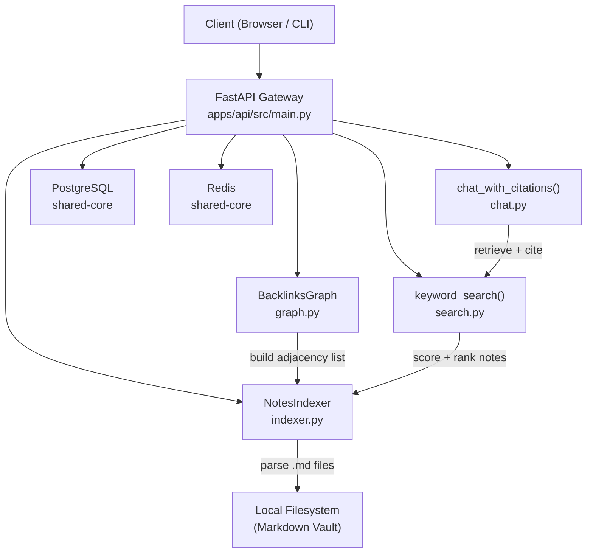

# Personal Knowledge Base OS


## A local-first knowledge management API that ingests markdown vaults, parses Obsidian-style wikilinks, builds a bidirectional backlinks graph, and supports keyword search and citation-grounded chat over your notes.

---

## Why This Exists

Most knowledge management tools treat notes as isolated documents. The interesting engineering is in the graph: when Note A links to Note B, Note B should know about it. This project builds the engine for that — note ingestion, wikilink extraction, bidirectional graph construction, and a retrieval layer that makes notes queryable by both keyword and chat.

It's also a foundation for a full RAG-over-personal-notes system: the indexer, backlinks graph, and search layer are the ingestion pipeline that a pgvector semantic search and Next.js frontend would be built on top of.

## What It Demonstrates

- **Local filesystem ingestion** — `NotesIndexer.parse_directory()` recursively reads `.md` files, strips extensions to resolve note titles, and applies regex to capture `[[wikilink]]` patterns
- **Bidirectional graph construction** — `BacklinksGraph.build_graph()` computes outbound adjacency lists and `get_backlinks()` reverses edges to return incoming links for any note
- **Keyword search with scoring** — `keyword_search()` scores notes by title match (100 pts exact, 50 pts partial), content frequency (2 pts/match), and per-word frequency; returns ranked results
- **Citation-grounded chat** — `chat_with_citations()` retrieves the top-k notes by keyword score and returns a grounded answer with source citations
- **Monorepo API layout** — `apps/api/src/` pattern designed to co-exist with a planned Next.js frontend in `apps/web/`
- **Shared infrastructure** — PostgreSQL, Redis, and structured logging via `shared-core`

## Architecture



### Request Flow — Note Indexing

1. `GET /notes/index?path=/my/vault` received
2. `NotesIndexer.parse_directory()` walks the folder, reads each `.md` file
3. `_extract_links()` runs `re.findall(r'\[\[(.*?)\]\]', content)` on each file
4. `BacklinksGraph.build_graph()` maps outbound links into an adjacency list
5. In-memory index is stored; JSON response returns note count + full graph

### Request Flow — Search & Chat

1. `GET /notes/search?q=python` — `keyword_search()` scores all indexed notes and returns ranked results
2. `POST /notes/chat?q=what is my architecture` — runs `keyword_search()` then `chat_with_citations()` to return a grounded answer with note citations

## Tech Stack

| Component | Technology | Justification |
|-----------|-----------|---------------|
| **API Framework** | FastAPI 0.100+ | Async-native, auto-generated OpenAPI docs |
| **Validation** | Pydantic v2 | Type-safe request/response schemas |
| **Database** | PostgreSQL 16 | Persistent note storage (planned) |
| **Cache** | Redis 7 | Graph and search result caching (planned) |
| **Logging** | Loguru via shared-core | Structured service-tagged logs |
| **Shared Library** | [shared-core](../shared-core/) | Config, database, redis, errors — shared across all portfolio projects |

## Monorepo Layout

```text
personal-knowledge-base-os/
├── apps/
│   └── api/                  # Python API Service
│       └── src/
│           ├── main.py       # FastAPI Entrypoint + endpoint routing
│           ├── indexer.py    # Notes Indexer & wikilink extractor
│           ├── graph.py      # BacklinksGraph adjacency manager
│           ├── search.py     # Keyword search with scoring
│           ├── chat.py       # Citation-grounded chat responses
│           ├── embeddings.py # MockEmbeddingGenerator (pgvector planned)
│           ├── worker.py     # Celery background worker scaffold
│           ├── config.py     # AppConfig (pydantic-settings)
│           └── errors.py     # Error mapping
├── demo_vault/               # Sample markdown notes with wikilinks
├── docs/                     # Architecture, design decisions, failure modes
├── examples/                 # Runnable demo script
├── tests/                    # Pytest test suite
├── Makefile                  # Developer shortcuts
└── docker-compose.yml        # PostgreSQL + Redis containers
```

## Local Setup

```bash
# Clone and enter the project
cd personal-knowledge-base-os

# Copy environment template
cp .env.example .env

# Start PostgreSQL and Redis
make docker-up

# Install shared-core and dependencies
make install

# Run the API server
make dev
# Server starts at http://localhost:8000
```

### Prerequisites

- Python 3.10+
- Docker and Docker Compose
- `shared-core` cloned as a sibling directory

## Demo

```bash
make demo
```

Runs `examples/run_demo.py`, which:

1. Starts the indexer pointed at `demo_vault/`
2. Indexes three linked markdown notes (`getting_started.md`, `notes_architecture.md`, `search_tips.md`)
3. Runs a keyword search for `"wikilinks"`
4. Runs a chat query: `"How does the graph work?"`
5. Prints the citation-grounded response

**Demo vault note example:**

```markdown
# Getting Started
Welcome to the Personal Knowledge Base OS.

See [[Notes Architecture]] for how notes are stored and [[Search Tips]] for querying your vault.
```

## API Reference

### `GET /notes/index?path=<directory>`

Ingest all markdown files in a directory. Parses wikilinks and builds the backlinks graph.

**Response:**
```json
{
  "total_notes": 3,
  "graph": {
    "getting_started": ["notes_architecture", "search_tips"],
    "notes_architecture": [],
    "search_tips": ["getting_started"]
  },
  "notes": [...]
}
```

### `GET /notes/search?q=<query>&limit=5`

Keyword search across all indexed notes with relevance scoring.

**Response:**
```json
{
  "query": "wikilinks",
  "results": [
    {"title": "getting_started", "content": "...", "links": ["notes_architecture"]}
  ],
  "total": 1
}
```

### `POST /notes/chat?q=<query>`

Retrieve top-k relevant notes and return a citation-grounded answer.

**Response:**
```json
{
  "answer": "Based on your notes: ...",
  "citations": [
    {"title": "notes_architecture", "snippet": "The graph maps outbound wikilinks..."}
  ]
}
```

### `GET /notes/{note_id}/backlinks`

Return all notes that link to the specified note.

**Response:**
```json
{
  "note_id": "notes_architecture",
  "backlinks": ["getting_started"]
}
```

### `GET /health`

```json
{
  "status": "healthy",
  "service": "personal-knowledge-base-os",
  "dependencies": {"database": "online", "redis": "online"}
}
```

## Tests

```bash
make test
```

Test coverage includes:
- Notes indexer parsing `.md` files and extracting wikilinks
- Backlinks graph adjacency construction and reversal
- Keyword search scoring and ranking
- Chat citation generation
- API endpoint integration tests

## Known Limitations

- **In-memory index** — notes are indexed into a Python list per-request via `parse_directory()`; not persisted to PostgreSQL. Restarting the server clears the index.
- **Keyword search only** — `semantic_search()` is a stub that wraps `keyword_search()`. Real pgvector-backed semantic search requires an embedding model and is planned for the next milestone.
- **Chat is template-based** — `chat_with_citations()` returns `"Based on your notes: {content[:200]}..."`. LLM-generated answers with retrieval-augmented prompting are on the roadmap.
- **Flat directory only** — `NotesIndexer.parse_directory()` uses `os.listdir()`, which does not recurse into subdirectories. Recursive traversal is planned.
- **No frontmatter parsing** — YAML frontmatter (`---`) in markdown files is not extracted. Metadata like `tags`, `date`, `aliases` are not indexed.

## Roadmap

- [x] **Phase 0** — Markdown ingestion, wikilink extraction, backlinks graph, keyword search, API scaffold
- [ ] **Phase 1** — pgvector embeddings, true semantic search, PostgreSQL note persistence
- [ ] **Phase 2** — Frontmatter metadata extraction, tag indexing, saved searches
- [ ] **Phase 3** — LLM-backed chat with RAG over indexed notes
- [ ] **Phase 4** — Next.js frontend with graph visualization, note viewer, backlinks panel

See [docs/roadmap.md](docs/roadmap.md) for detailed milestone breakdowns.

## Related Projects

- **[document-intelligence-pipeline](../document-intelligence-pipeline/)** — upstream ingestion pipeline for PDFs and DOCX that produces the same note format
- **[rag-evaluation-lab](../rag-evaluation-lab/)** — evaluates retrieval quality using the same golden question + hit-rate methodology

## License

MIT

