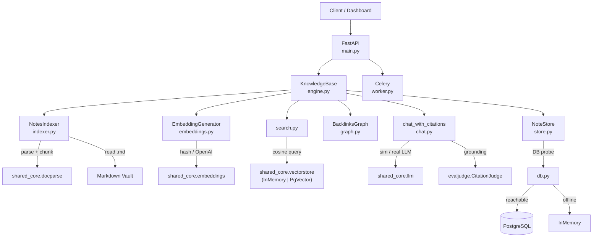

# Personal Knowledge Base OS


> A local-first knowledge base API: point it at a folder of markdown notes and get
> keyword + semantic search, an Obsidian-style backlinks graph, and chat over your
> notes with grounded citations — running fully offline, with no API keys.

---

## Why this exists

Most note tools treat files as isolated documents. The interesting engineering is
in connecting them: turning a vault of markdown into a **graph** you can traverse,
a **vector index** you can search by meaning, and a **retrieval layer** that can
answer questions while citing its sources.

This project is that engine. It is also a study in **offline-first, real-when-keyed**
design: every external dependency (database, embeddings, LLM, Redis) has a
deterministic local default and a real implementation that activates only when
configured — so it runs, tests, and demos with nothing but Python.

## What it demonstrates

- **Markdown vault ingestion** — parse + chunk via `shared_core.docparse`, plus
  `[[wikilink]]`, `#hashtag`, and YAML-frontmatter extraction (`indexer.py`).
- **Semantic search** — real vector retrieval over `shared_core.vectorstore`
  (in-memory offline, pgvector when a DB is configured), with chunk-to-note
  roll-up; keyword and hybrid modes too (`search.py`).
- **Offline + real embeddings** — `shared_core.embeddings`: a deterministic hash
  fallback by default, OpenAI `text-embedding-3-small` when keyed. No torch /
  sentence-transformers (`embeddings.py`).
- **Bidirectional backlinks graph** — outbound adjacency, reverse backlinks, and a
  `{nodes, edges}` export sized for a force-directed UI (`graph.py`).
- **Chat with citations (RAG)** — retrieve chunks, answer with a simulated or real
  LLM, and **score** the citation grounding with
  `shared_core.evaljudge.CitationJudge` (`chat.py`).
- **Persistence with graceful fallback** — notes/chunks persist to PostgreSQL by
  default, with a fast DB probe that falls back to in-memory so tests/demos need no
  database (`db.py`, `store.py`, `models.py`, `alembic/`).
- **Real worker** — Celery tasks via `shared_core.tasks.create_celery_app`,
  importable with no broker (`worker.py`).

## Architecture



See [docs/architecture.md](docs/architecture.md) for indexing, chat, and
persistence sequence diagrams.

## Tech stack

| Component | Technology | Why |
|-----------|-----------|-----|
| API | FastAPI + Pydantic v2 | Async, typed, auto OpenAPI |
| Embeddings | `shared_core.embeddings` | Offline hash fallback / OpenAI when keyed |
| Vector search | `shared_core.vectorstore` | In-memory offline / pgvector in prod |
| Parsing | `shared_core.docparse` | Shared markdown parse + chunking |
| RAG grounding | `shared_core.evaljudge` | `CitationJudge` scores citations |
| LLM | `shared_core.llm` | OpenAI / Anthropic, mock for tests |
| Persistence | SQLAlchemy + Alembic | `notes` / `note_chunks`, JSON embeddings |
| Worker | Celery via `shared_core.tasks` | Off-request indexing |
| Database / Cache | PostgreSQL 16 / Redis 7 | Persistence + health |
| Shared library | [shared-core](../shared-core/) | Config, DB, errors, logging, AI infra |

## Monorepo layout

```text
personal-knowledge-base-os/
├── apps/api/src/            # Python package root (imported as apps.api.src)
│   ├── main.py              # FastAPI app + endpoints + lifespan DB probe
│   ├── engine.py            # KnowledgeBase orchestration
│   ├── indexer.py           # parse, chunk, wikilinks/tags/frontmatter
│   ├── embeddings.py        # shared_core embeddings facade
│   ├── search.py            # keyword + semantic + hybrid search
│   ├── chat.py              # RAG chat + CitationJudge grounding
│   ├── graph.py             # backlinks graph + nodes/edges export
│   ├── store.py / models.py / db.py   # persistence + fallback
│   ├── worker.py            # Celery tasks
│   └── config.py
├── apps/web/                # Next.js 14 dashboard (search, graph, chat, tags)
├── alembic/                 # DB migrations
├── demo_vault/              # 10 interlinked sample notes
├── docs/                    # architecture, decisions, failure modes, security…
├── examples/run_demo.py     # end-to-end offline demo
└── tests/                   # 100 tests (unit, integration, API, worker, golden)
```

## Setup

```bash
# Create a venv and install shared-core + this project (offline-capable)
python -m venv .venv && source .venv/bin/activate    # Windows: .venv\Scripts\activate
pip install -e "../shared-core[dev,docparse]" numpy
pip install -e ".[dev]"

# (optional) real persistence — start Postgres + Redis, then migrate
make docker-up
alembic upgrade head

# Run the API (works with or without a database)
make dev          # http://localhost:8000  (docs at /docs)
```

To enable real embeddings / chat, set `OPENAI_API_KEY` (or `ANTHROPIC_API_KEY`) in
`.env`. With no keys, the service uses deterministic offline embeddings and a
simulated, citation-bearing chat answer.

## Demo

```bash
make demo     # python examples/run_demo.py
```

Runs fully offline and:

1. Indexes the bundled `demo_vault/` (10 interlinked notes with frontmatter/tags).
2. Runs a keyword search and a semantic search.
3. Prints backlinks for a note and the graph's most-linked hub.
4. Lists tags.
5. Asks a question and prints a citation-grounded answer (asserting it's grounded).

Exits `0` on success.

## API reference

| Method | Path | Description |
|--------|------|-------------|
| `POST` | `/notes/index` | Ingest a vault (`{path?}`); returns summary + graph |
| `GET`  | `/notes/index` | GET wrapper (`?path=`) for dashboards |
| `GET`  | `/notes/search` | `?q=&limit=&mode=keyword\|semantic\|hybrid` |
| `POST` | `/notes/chat` | `{query, limit?}` → grounded answer + citations |
| `GET`  | `/notes/{id}` | Note content, links, tags, metadata, backlinks |
| `GET`  | `/notes/{id}/backlinks` | Notes linking to `{id}` |
| `GET`  | `/graph` | `{nodes, edges}` for a visualization UI |
| `GET`  | `/tags` | Tag → note-count rollup |
| `GET`  | `/stats` | Note / chunk / tag counts |
| `GET`  | `/health` | Service + DB + Redis status |

**Chat response shape:**

```json
{
  "answer": "Based on your notes... [1] ... [2]",
  "citations": [{"index": 1, "id": "backlinks_graph", "title": "Backlinks Graph", "snippet": "..."}],
  "grounded": true,
  "citation_score": 1.0,
  "model": "simulated",
  "mode": "simulated"
}
```

## Tests

```bash
make test     # pytest -q  → 100 passed
```

Coverage: embeddings, keyword + semantic search, graph export, indexer +
frontmatter/tag extraction, chat citations, persistence (SQLite via
`MockDatabase`), the engine end-to-end, the Celery worker, every API endpoint
(success + error), and golden/regression tests that pin embedding output, citation
scores, and the deterministic semantic ranking so AI behavior can't silently drift.

## Limitations

- **Synchronous indexing** — `/notes/index` indexes in-process; the worker task
  (`kb.index_vault`) exists but the endpoint doesn't dispatch to it yet.
- **Offline semantics are coarse** — the deterministic hash embeddings give stable
  but weak semantic signal; real OpenAI embeddings (when keyed) are far stronger.
- **Path sandboxing documented, not enforced** — see `docs/security.md` before
  exposing `/notes/index` to untrusted callers.

## Roadmap

- [x] **Phase 1** — ingestion, wikilinks, backlinks graph, keyword search.
- [x] **Phase 2** — embeddings, semantic/hybrid search, RAG chat with scored
      citations, persistence + Alembic, worker, full endpoints, 100 tests.
- [x] **Phase 3** — Next.js 14 dashboard (`apps/web/`): search, note viewer,
      force-directed graph over `/graph`, cited chat, tag browser, demo-mode
      fallback, component/page tests + Playwright smoke spec.
- [ ] **Phase 4** — filesystem watcher, incremental indexing, multi-vault, flashcards.

See [docs/roadmap.md](docs/roadmap.md) and [docs/EXECUTION_PLAN.md](docs/EXECUTION_PLAN.md).

## Related projects

- **[document-intelligence-pipeline](../document-intelligence-pipeline/)** —
  upstream ingestion pipeline (PDF/DOCX) sharing the same docparse + vectorstore.
- **[rag-evaluation-lab](../rag-evaluation-lab/)** — evaluates retrieval quality
  using the same judge methodology.

## License

MIT
