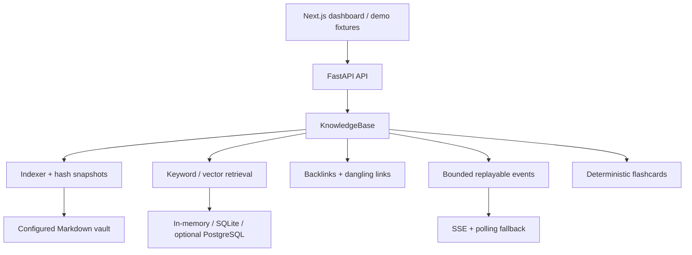

# Personal Knowledge Base OS


> Local knowledge-base API with backlinks and citation-grounded chat.

Personal Knowledge Base OS turns local Markdown vaults into a navigable backlinks graph, a deterministic retrieval index, and a cited chat surface. It is offline-first: the default API, demo, tests, and dashboard fixtures work without credentials, network access, PostgreSQL, Redis, or Celery workers.

## What it delivers

- Markdown ingestion with frontmatter, tags, Obsidian-style wikilinks, backlinks, and explicit dangling-link metadata.
- Keyword, semantic, and hybrid retrieval; deterministic hash embeddings and simulated cited chat by default.
- Vault namespaces with `vault_id="default"` compatibility, tag-scoped search, saved searches, and per-vault graph/statistics views.
- Safe local note editing: configured vault-root containment, symlink rejection, text/size validation, incremental re-indexing, and deterministic change events.
- Explicit stdlib polling watchers, replayable Server-Sent Events (SSE), and a dashboard polling fallback. Watchers never start implicitly.
- Deterministic, source-cited flashcards with local spaced-repetition review state; LLM enrichment is optional and falls back locally.
- SQLite/in-memory persistence fallbacks, additive Alembic schema, broker-free Celery imports, and an optional PostgreSQL/Redis/provider path.

## Architecture


```mermaid
graph TD
    UI["Next.js dashboard / demo fixtures"] --> API["FastAPI API"]
    API --> KB["KnowledgeBase"]
    KB --> IDX["Indexer + hash snapshots"]
    KB --> RET["Keyword / vector retrieval"]
    KB --> GRAPH["Backlinks + dangling links"]
    KB --> EVENTS["Bounded replayable events"]
    KB --> CARDS["Deterministic flashcards"]
    IDX --> VAULT["Configured Markdown vault"]
    RET --> STORE["In-memory / SQLite / optional PostgreSQL"]
    EVENTS --> SSE["SSE + polling fallback"]
```

The vendored compatibility closure lives at `apps/api/src/internal/vendor_core/`. It contains the pinned, MIT-licensed subset from `operator-shared-core` v1.3.0 (`dbf276a7708da65b55e1f10b35af634b300d1f07`); no sibling checkout or Git-installed package is required. See [THIRD_PARTY_NOTICES.md](THIRD_PARTY_NOTICES.md).

## Setup

```bash
# Python API and verification tooling
python -m pip install -e ".[dev]"

# Dashboard (the only Node package in this repository)
cd apps/web
npm ci
```

Run the API without infrastructure:

```bash
python -m apps.api.src.main
python examples/run_demo.py
```

`postgres`, `redis`, `worker`, `providers`, `parsers`, `embeddings`, and `watcher` are optional extras. PostgreSQL/pgvector, Redis, Celery, OpenAI, Anthropic, watchdog, OCR, and heavy parsers are integrations—not requirements for the offline demo or default test path.

## API compatibility and additive surfaces

Legacy routes and response keys remain available. Unless supplied, `vault_id` is `default`.

| Method | Path | Purpose |
| --- | --- | --- |
| `POST` / `GET` | `/notes/index` | Full or incremental vault indexing (`incremental=false` remains the legacy default). |
| `GET` | `/notes/search` | Keyword, semantic, or hybrid search; optional `tags` and `vault_id`. |
| `POST` | `/notes/chat` | Citation-grounded simulated or provider-backed chat. |
| `GET` / `PATCH` | `/notes/{id}` | Read a note or safely edit it in its configured vault. |
| `GET` | `/notes/{id}/backlinks`, `/graph`, `/tags`, `/stats` | Graph, dangling metadata, and vault-scoped metadata. |
| `GET` / `POST` | `/vaults`, `/vaults/{vault_id}/select` | Additive vault registration and selection. |
| `GET` / `POST` / `DELETE` | `/saved-searches` | Per-vault saved retrieval definitions. |
| `GET` / `POST` | `/flashcards`, `/flashcards/generate`, `/flashcards/{id}/review` | Deterministic generation and local review state. |
| `GET` / `POST` | `/watchers/{vault_id}`, `/events`, `/events/replay` | Explicit watcher lifecycle, SSE, and replay/polling fallback. |

The graph keeps its legacy `{nodes, edges}` keys. Additive dangling-link metadata makes unresolved wikilinks visible without changing legacy graph consumers.

## Safety and local boundaries

The index and editor accept only configured vault roots. They reject path escapes and symlink components, constrain edit content to text and a 2 MiB limit, and return validation errors rather than reading or writing arbitrary paths. The service does not execute note contents or spawn commands from note data.

This is a local-first supporting system, not a hosted collaboration product. Authentication, multi-user tenancy, cloud storage, mandatory schedulers, external notifications, live provider evaluation, and production infrastructure remain deliberately out of scope.

## Verification and portfolio evidence

```bash
python -m pytest -q
python -m ruff check apps/api/src tests examples scripts
python -m ruff format --check apps/api/src tests examples scripts
python -m pyright apps/api/src
python examples/run_demo.py
python scripts/portfolio_demo.py
python scripts/verify_portfolio_evidence.py
python -m build
python scripts/check_wheel_contents.py
python -m alembic upgrade head
python scripts/check_forbidden_dependencies.py
```

The evidence bundle is generated under the ignored `artifacts/portfolio/personal-knowledge-base-os-evidence/` directory. Its verifier checks normalized reproducibility, canonical JSON, manifest membership, and checksums. Final command results, test totals, and the reproducibility hash are recorded in the portfolio finalization receipt rather than guessed in this README.

For dashboard gates:

```bash
cd apps/web
npm ci
npm test -- --run
npx tsc --noEmit
npm run lint
npm run build
npx playwright install chromium
npm run test:e2e -- --project=chromium
```

## Roadmap status

- Delivered: ingestion, backlinks, citations, persistence fallbacks, dashboard/demo mode, graph dangling-link metadata, editing, multi-vault namespaces, tag filters, saved searches, incremental indexing, explicit polling watchers, replayable SSE, deterministic flashcards, and local review scheduling.
- Optional: PostgreSQL/pgvector, Redis, Celery workers, provider SDKs, watchdog acceleration, document/OCR/model extras.
- Deferred: authentication, hosted collaboration, cloud storage, mandatory infrastructure, hosted scheduling, and provider-required workflows.

Historical plans and the initial 100-test implementation snapshot are retained in the repository for provenance only; they are not current verification claims.

## License

MIT
