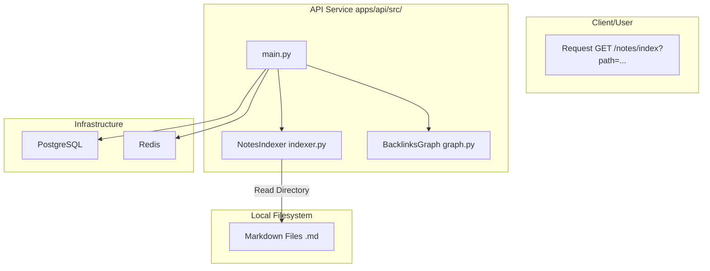
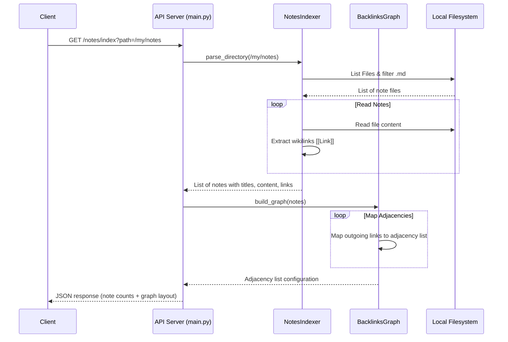

# Architectural Design - Personal Knowledge Base OS

This document details the architectural layout, component maps, and dataflow of the Personal Knowledge Base OS API service.

---

## 1. System Overview

The Personal Knowledge Base OS is structured around a decoupled processing model:
1. **Directory Ingestion Layer (`indexer.py`)**: Responsible for file system discovery, file filtering, reading file bytes, and parsing link patterns.
2. **Graph Compilation Layer (`graph.py`)**: Computes directional graph edges and backlinks (incoming nodes).
3. **HTTP Web Layer (`main.py`)**: Serves the REST API interfaces.

---

## 2. Component Diagram

---

## 3. Data Processing Sequence

---

## 4. Component Breakdown

### 4.1 Notes Indexer (`indexer.py`)
- **`NotesIndexer`**: Interacts with the filesystem. Reads file contents, strips extensions to resolve note titles, and applies standard regular expression matchers (`r'\[\[(.*?)\]\]'`) to capture wikilinks.

### 4.2 Backlinks Graph (`graph.py`)
- **`BacklinksGraph`**: In-memory graph model. It processes parsed notes, creates nodes for each note title, and inserts links into directed sets.
- **`get_backlinks`**: Reverses directed edges. Iterates through the graph adjacency list, checking which source nodes link to a target node, compiling an incoming links list dynamically.

### 4.3 API Entrypoint (`main.py`)
- **FastAPI**: Runs the web server, maps config schemas from `shared-core`, and registers application exception handlers.
- **Path Parameter Handler**: Calls the indexer and graph compiler, wrapping output into an API response schema.
