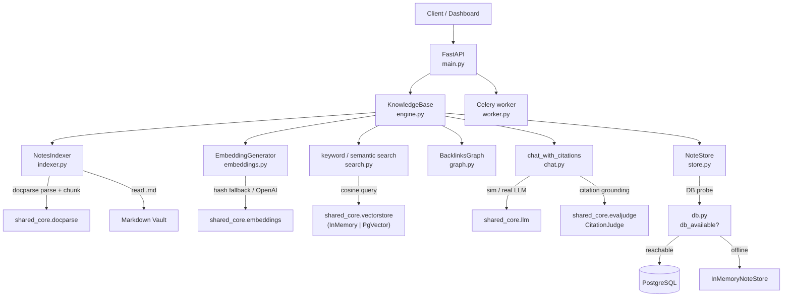
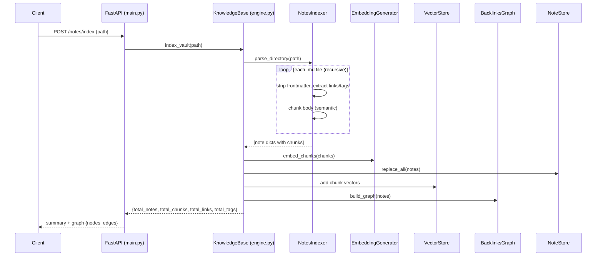
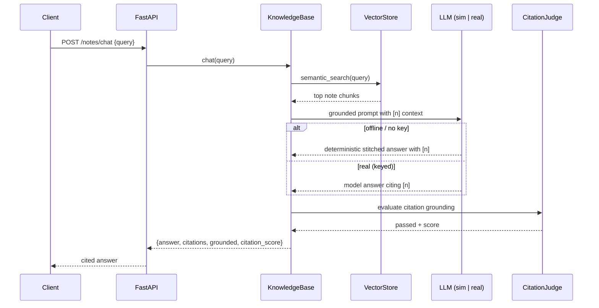

# Architecture — Personal Knowledge Base OS

This document describes the components, data flow, and persistence model of the
Personal Knowledge Base OS API service.

---

## 1. System overview

The service turns a folder of markdown files (a "vault") into a queryable
knowledge base. It is offline-first: it boots and serves with **no database, no
API key, and no network**, and transparently upgrades to PostgreSQL + pgvector +
real LLM/embedding providers when those are configured.

The pipeline has five layers:

1. **Ingestion (`indexer.py`)** — parses markdown via `shared_core.docparse`,
   strips YAML frontmatter, extracts `[[wikilinks]]`, `#hashtags`, and metadata,
   and chunks each note for embedding.
2. **Embedding (`embeddings.py`)** — wraps `shared_core.embeddings`: a
   deterministic offline hash fallback by default, the real OpenAI endpoint when
   `OPENAI_API_KEY` is set.
3. **Retrieval (`search.py`)** — keyword scoring + semantic vector search over
   `shared_core.vectorstore` (in-memory offline, pgvector when keyed).
4. **Graph (`graph.py`)** — bidirectional backlinks adjacency + a `{nodes, edges}`
   export for a visualization UI.
5. **Orchestration + API (`engine.py`, `main.py`)** — the `KnowledgeBase` engine
   ties the layers together; FastAPI exposes them as REST endpoints.

Persistence (`db.py`, `store.py`, `models.py`) and the Celery worker (`worker.py`)
sit alongside, both selecting their backend from the same DB-availability probe.

---

## 2. Component diagram

---

## 3. Indexing sequence

---

## 4. Chat (RAG) sequence

---

## 5. Persistence model

Two layers serve different needs:

- **Relational store (`store.py` + `models.py`)** — `notes` and `note_chunks`
  tables hold the canonical note content, links, tags, metadata, and chunk
  embeddings (embeddings as JSON so the schema is SQLite-compatible for the
  offline test fallback). Managed by Alembic (`alembic/`).
- **Vector store (`shared_core.vectorstore`)** — the search index. In-memory and
  recomputable offline; pgvector (`note_vectors` table, `notes` namespace) when a
  database is configured.

The DB-availability probe (`db.py`) does a fast ~0.25s TCP pre-check followed by a
`SELECT 1`. On success notes persist to PostgreSQL and survive restarts (the
engine rebuilds the graph + vectors from the store on startup via
`reindex_from_store`). On failure everything falls back to in-memory.

---

## 6. Module inventory

| Module | Responsibility |
|--------|----------------|
| `main.py` | FastAPI app, endpoints, lifespan DB probe, middleware |
| `engine.py` | `KnowledgeBase` orchestration (index / search / chat / graph) |
| `indexer.py` | Parse, chunk, extract wikilinks / tags / frontmatter |
| `embeddings.py` | Sync facade over `shared_core.embeddings` (offline/real) |
| `search.py` | Keyword scorer + semantic vector retrieval |
| `chat.py` | RAG answer (sim/real LLM) + `CitationJudge` grounding |
| `graph.py` | Backlinks adjacency + `{nodes, edges}` export |
| `store.py` | `InMemoryNoteStore` + `DatabaseNoteStore` |
| `db.py` | DB-availability probe + store selection |
| `models.py` | SQLAlchemy `Note` / `NoteChunk` |
| `worker.py` | Celery tasks (`kb.index_vault`, `kb.reindex`) |
| `config.py` | `AppConfig` (extends `shared_core` `BaseAppConfig`) |
