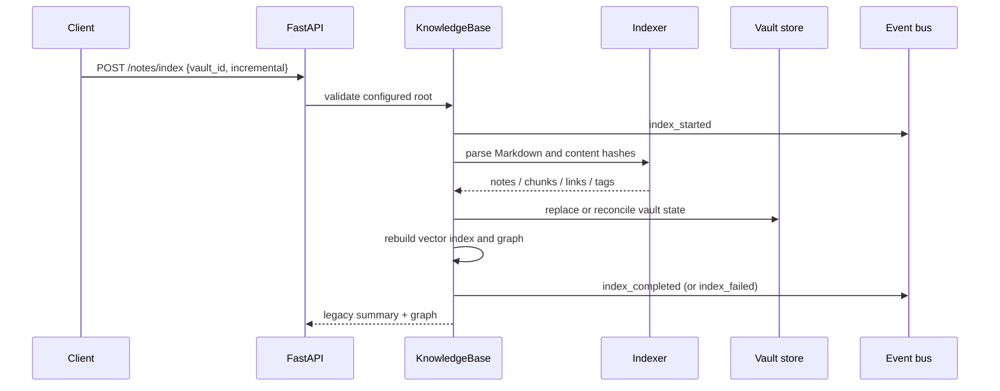

# Architecture — Personal Knowledge Base OS

Personal Knowledge Base OS is a local-first Markdown knowledge-base service. The default path is synchronous, deterministic, in-memory, and credential-free; adapters for databases, brokers, providers, heavy parsers, and filesystem accelerators are optional.

## Layers

| Layer | Responsibility | Offline default |
| --- | --- | --- |
| API | Legacy FastAPI routes plus additive vault, editing, watcher, events, saved-search, and flashcard routes. | In-process API with `vault_id="default"`. |
| Engine | Coordinates indexing, stores, graph, retrieval, chat, event emission, and watcher lifecycle. | `KnowledgeBase`; in-memory by default, with explicit SQLite runtime-state persistence. |
| Indexer | Parses Markdown, extracts metadata/wikilinks/tags, chunks content, and hashes normalized content. | Standard-library filesystem handling and vendored deterministic parser. |
| Retrieval | Keyword, semantic, and hybrid result assembly with citations. | Hash embeddings and in-memory vector store. |
| Graph | Forward/reverse links and graph export. | `{nodes, edges}` plus additive dangling metadata. |
| Local productivity | Safe edits, snapshots/incremental changes, saved searches, flashcards, review scheduling. | Deterministic IDs; in-memory by default, SQLite-persisted when configured. |
| Live updates | Explicit polling watcher, bounded replay buffer, SSE serialization. | No watcher at startup; caller starts it. |
| Persistence | Notes/chunks and additive scoped records. | In-memory/SQLite-compatible service checks. |

## Namespace and containment model

Every public operation accepts an additive `vault_id`; omitted values resolve to `default`, preserving pre-expansion callers. State is scoped by vault: notes, vectors, graph, tags, searches, cards, reviews, watcher handles, and events do not cross namespace boundaries.

A vault must be explicitly registered before a non-default API indexing path is used. Indexing and editing retain the configured root, reject symlink components, resolve the target safely, and reject targets outside that root. The editor accepts text only and limits content to 2 MiB. These checks are service-level safeguards in every supported store mode; they do not imply user authentication or a hosted multi-tenant security boundary.

## Index and incremental sequence

```mermaid
sequenceDiagram
  participant C as Client
  participant A as FastAPI
  participant K as KnowledgeBase
  participant I as Indexer
  participant S as Vault store
  participant E as Event bus

  C->>A: POST /notes/index {vault_id, incremental}
  A->>K: validate configured root
  K->>E: index_started
  K->>I: parse Markdown and content hashes
  I-->>K: notes / chunks / links / tags
  K->>S: replace or reconcile vault state
  K->>K: rebuild vector index and graph
  K->>E: index_completed (or index_failed)
  K-->>A: legacy summary + graph
```

The legacy full-index path remains the default. Incremental requests compare deterministic snapshots to report added, changed, and deleted note IDs. A deletion is reflected by replacing the vault-scoped corpus and rebuilding the in-memory graph/vector state from the surviving notes.

## Graph, watcher, and events

Graph consumers continue to receive `{nodes, edges}`. Nodes/metadata now identify unresolved wikilink targets so dashboards can distinguish dangling links without losing compatibility.

The polling watcher is an explicit local process. It detects Markdown changes, invokes the same incremental indexing service, and emits `watcher_started`, `note_changed`, `index_started`, `index_completed`, `index_failed`, and `watcher_stopped`. Optional watchdog availability is detected but never required.

`EventBus` keeps a bounded, vault-scoped replay buffer with monotonically increasing event IDs. `GET /events` serializes the buffer as SSE, emits heartbeats when idle, and accepts either `last_event_id` or `Last-Event-ID`. `GET /events/replay` supports clients that must poll instead. Events are local runtime metadata, not a promise of durable distributed event delivery.

## Persistence and migrations

The initial schema stores notes and chunks. The additive milestone migration introduces vault metadata, scoped note/chunk columns, file snapshots, saved searches, flashcards, flashcard review state, watcher state, and replay-event metadata. Composite vault predicates keep namespace queries explicit; the default namespace backfills as `default`.

PostgreSQL/pgvector can be selected by configuration. SQLite and in-memory fallback remain valid for the local demo and test path. Redis locks and Celery task dispatch are optional adapters; Celery task modules remain importable without a broker.

## Vendor compatibility closure

`apps/api/src/internal/vendor_core/` is the private namespace for the pinned `operator-shared-core` v1.3.0 import closure. It supplies configuration, database, document parsing, embeddings, errors, evaluation/judging, health, LLM helpers, logging, Redis helpers, tasks, testing, vector store, and transitive pricing. Runtime modules import this namespace, not an external `shared_core` package. See [THIRD_PARTY_NOTICES.md](../THIRD_PARTY_NOTICES.md) for provenance and patches.

## Optional-provider boundary

OpenAI/Anthropic generation, real embeddings, PostgreSQL/pgvector, Redis, Celery, watchdog, OCR, and heavy document/model packages are optional extras. A missing optional SDK or failed provider call is handled by deterministic/local behavior where the API contract permits it. No route requires network credentials in the default configuration.
